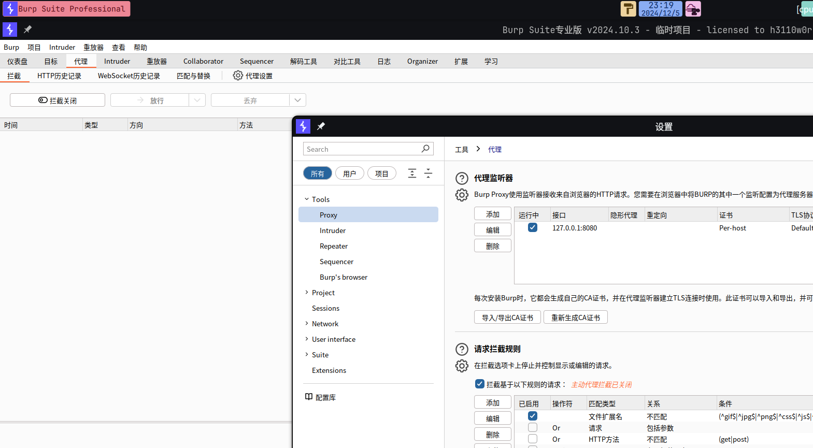
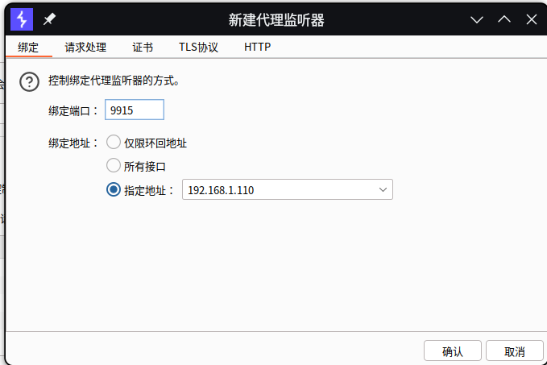
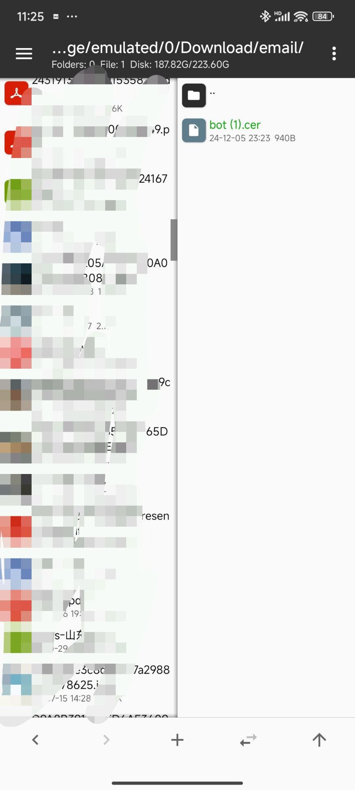
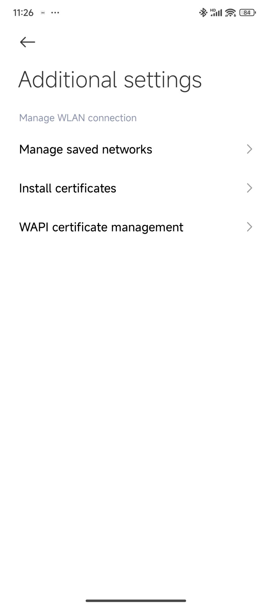
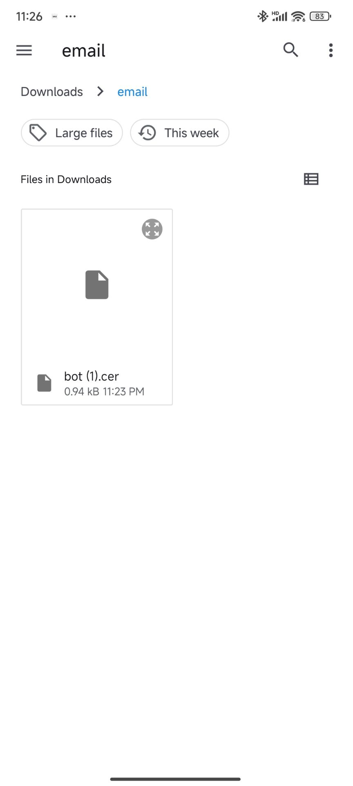
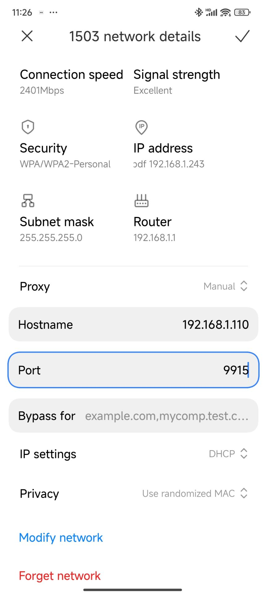

# 使用 BurpSuite 进行手机抓包教程

BurpSuite的安装与破解教程这里就不再讲述了，可以去参考[BurpSuite Pro 2024 破解&汉化](https://nfbyte.com/archives/burpsuite-pro-2024-po-jie-han-hua)

## 演示版本

- BurpSuite Professional 2024.10.1
- BurpSuiteCN 4.11.22
- BurpLoaderKeygen 1.17

## 抓包教程

### 证书获取

首先打开 burpsuite，进入代理页面，然后点击右边的**代理设置**，在代理监听器中点击 **添加** 按钮。

----

之后绑定端口我们指定为 `9915` (这个端口号不固定，也可以自己改一个其他的)。

保证手机和电脑处在同一个局域网下（演示时我的手机和电脑都连接的宿舍路由器），可以使用电脑产生热点，（注意 sdu_net 下的设备不算处于一个局域网中）。

指定地址选择 `192.168.x.y` 格式的，这个是你在局域网中的 IP 地址。

之后点击 `导入/导出证书` 按钮，选择弹出的第一项，即 `导出 cer 格式的证书` ，注意导出文件的时候文件名要自己手动加 `.cer` 后缀。

### 证书安装

通过任意一种方式将证书发送到你的手机上，并且手机安装 **MT文件管理器**，在 MT 中搜索你的证书名，并把证书移动到 `Downloads` 目录下。

之后打开手机设置，在 `WiFi` --> `更多设置` --> `安装证书` 找到刚才复制到 `Downloads` 目录下的证书，并安装，随意取一个名字就好。

之后在 `WiFi` 中连接刚才电脑产生的热点，并设置代理：

 ### 获取抓包信息

之后我们手机打开 山大V卡通2.0，在 HTTP历史记录 中就可以看到抓包的信息，我们任意打开一个记录就能看到我们的 `Synjones-Auth` 字段信息，保存下来即可。

