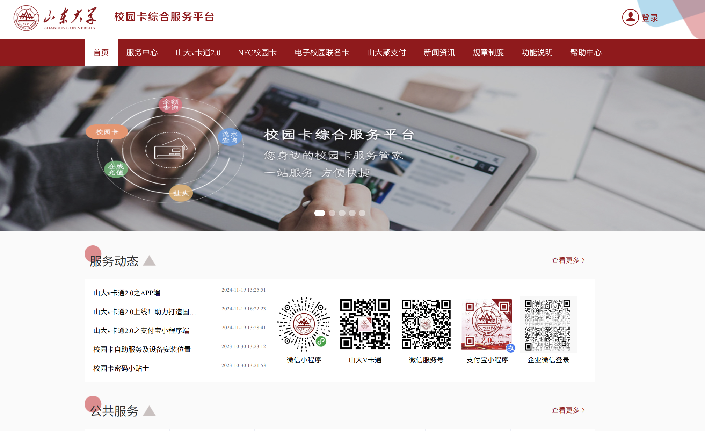
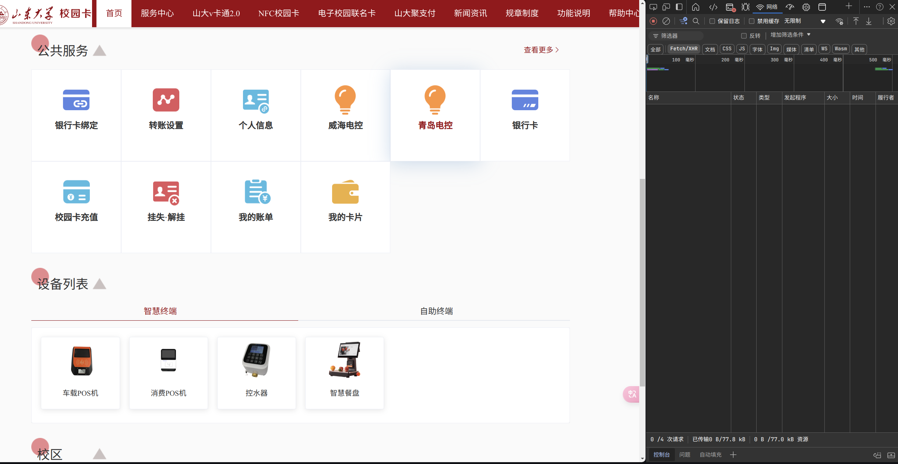
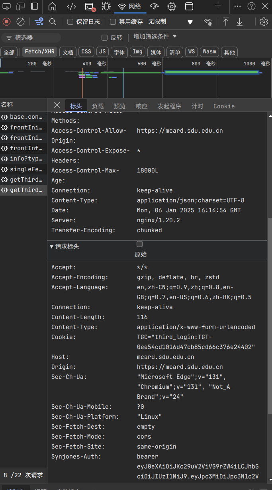

# 网页端抓包教程

## 演示环境

- 演示浏览器：Microsoft Edge 131.0.2903.112 (正式版本) (64 位)
- 演示时间 2025年1月7日

## 演示过程

1. 首先打开[网页版一卡通](https://mcard.sdu.edu.cn/plat-pc/serviceclassification)，登陆自己的账号。

2. 之后按下键盘上的 `F12` 按钮，进入开发者模式，找到网络选项并点击，之后在主页面-公共服务中找到青岛电控选项，并点击。

3. 之后会发现右边多了一些信息，我们选择一个叫做 `getThirdData` 的选项，会看到如下页面，我们下滑就能找到我们想要的 `Synjones-Auth` 字段了。

